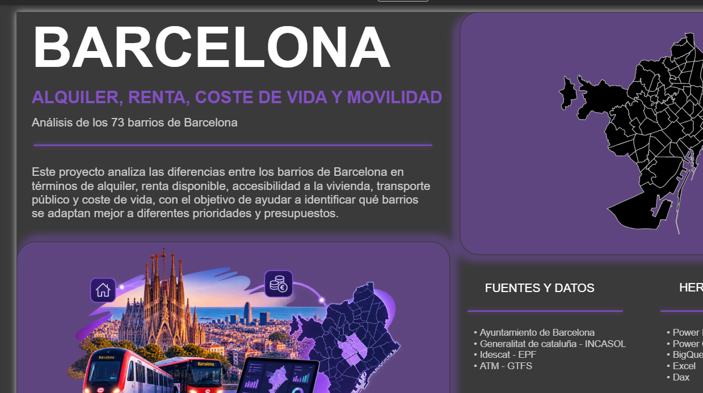
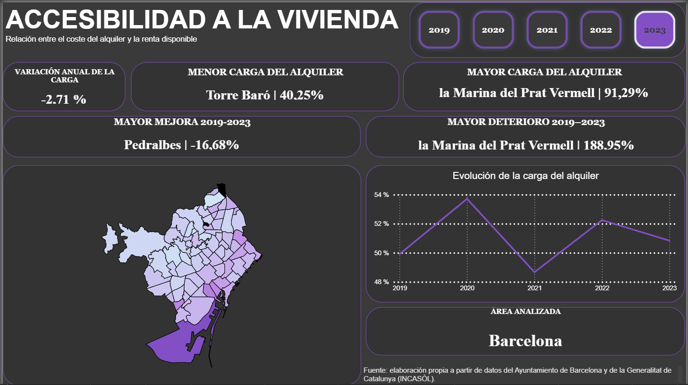
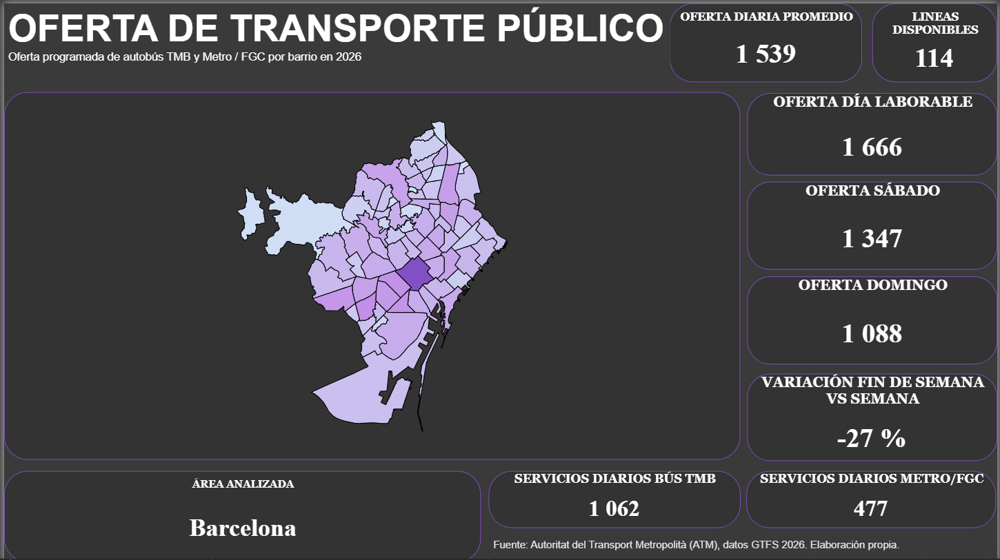
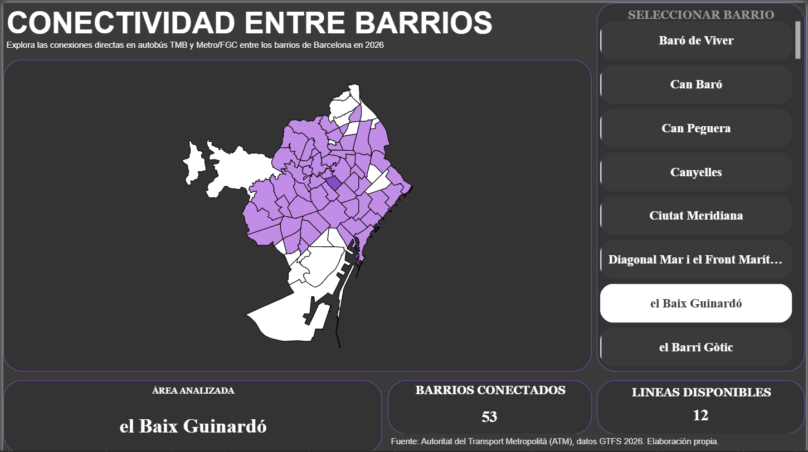
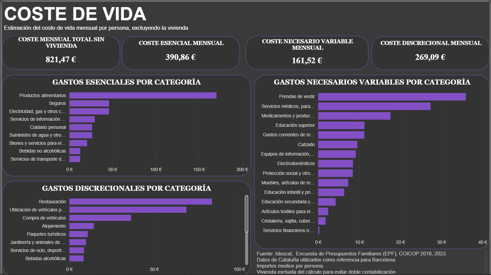
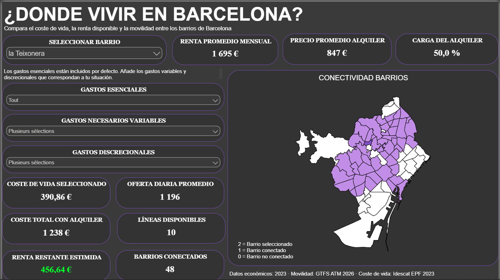

# Barcelona --- Vivienda, renta, coste de vida y movilidad

### Análisis de los 73 barrios de Barcelona

Este proyecto analiza las diferencias entre los **73 barrios de
Barcelona** en términos de alquiler, renta disponible, accesibilidad a
la vivienda, coste de vida y transporte público.

El objetivo no es identificar un único *«mejor barrio para vivir»*, sino
construir una herramienta de análisis que permita comprender los
**compromisos entre coste de la vivienda, recursos económicos y
movilidad urbana**.

El proyecto combina datos públicos y oficiales del **Ajuntament de
Barcelona**, la **Generalitat de Catalunya / INCASÒL**, **Idescat** y la
**Autoritat del Transport Metropolità (ATM)**, procesados mediante
**Power BI, Power Query, BigQuery, SQL, DAX y Excel**.

> **Períodos de referencia:** vivienda y renta 2019--2023 · coste de
> vida 2023 · movilidad GTFS 2026

**[Explorar el informe interactivo en Power BI](ENLACE_POWER_BI)**



*Vista general del proyecto, fuentes de datos y herramientas
utilizadas.*

------------------------------------------------------------------------

## 1. Pregunta de análisis

Barcelona presenta importantes diferencias territoriales tanto en el
mercado de la vivienda como en la distribución de la renta y en el
acceso al transporte público.

A partir de esta situación, el proyecto intenta responder a una pregunta
principal:

> **¿Cómo varían las condiciones para vivir entre los barrios de
> Barcelona cuando se analizan conjuntamente vivienda, renta, coste de
> vida y movilidad?**

El análisis se articula alrededor de varias preguntas:

-   ¿Cómo han evolucionado los alquileres entre 2019 y 2023?
-   ¿Cómo se distribuye la renta disponible entre los barrios?
-   ¿Dónde existe una mayor presión entre alquiler y renta?
-   ¿Qué barrios han experimentado un deterioro reciente de esta
    relación?
-   ¿Cómo se distribuye la oferta programada de transporte público?
-   ¿Qué barrios presentan una mayor conectividad directa?
-   ¿Puede un barrio relativamente asequible presentar una movilidad
    limitada?
-   ¿Por qué no existe necesariamente un único barrio óptimo para todos
    los perfiles?

------------------------------------------------------------------------

## 2. Fuentes de datos

El proyecto utiliza principalmente fuentes públicas y oficiales.

### Vivienda

**Ajuntament de Barcelona / Generalitat de Catalunya --- INCASÒL**

Datos de alquiler elaborados a partir de las fianzas de los contratos
depositadas en INCASÒL.

-   **Período utilizado:** 2019--2023
-   **Unidad principal:** alquiler mensual medio por vivienda y barrio
-   **Fuente oficial:** [Anuari Estadístic de la Ciutat de
    Barcelona](https://bcnroc.ajuntament.barcelona.cat/jspui/bitstream/11703/143700/6/Anuari%20Barcelona%202024.WEB%20%282%29.pdf)

### Renta

**Ajuntament de Barcelona --- Departamento de Estadística y Difusión de
Datos**

Renta disponible de los hogares por persona y por barrio.

-   **Período utilizado:** 2019--2023
-   **Unidad:** renta disponible anual por persona
-   Para facilitar la comparación con el alquiler, la renta anual se
    transforma en equivalente mensual dividiendo entre 12.
-   **Fuente oficial:** [Anuari Estadístic de la Ciutat de Barcelona
    2024](https://bcnroc.ajuntament.barcelona.cat/jspui/bitstream/11703/143700/3/Anuari%20Barcelona%202024.WEB%20%281%29.pdf)

### Coste de vida

**Idescat --- Estadística de gasto en consumo de los hogares / Encuesta
de Presupuestos Familiares (EPF)**

Datos de gasto medio por persona según categorías de consumo.

-   **Año utilizado:** 2023
-   **Ámbito territorial:** Cataluña
-   **Clasificación:** ECOICOP/EPF, nivel detallado de 3 dígitos
-   Los datos de Cataluña se utilizan como **referencia para
    Barcelona**, ya que no se dispone del mismo nivel de detalle por
    categoría para la ciudad.
-   Los gastos de vivienda se excluyen del cálculo para evitar doble
    contabilización con el alquiler.
-   **Fuente oficial:** [Idescat --- gasto anual por grupos de gasto
    ECOICOP/EPF](https://idescat.cat/pub/?id=edcl&lang=ca&n=9433)

> **Nota metodológica:** Idescat señala una ruptura de serie en los
> datos de 2023. Por ello, estos valores se utilizan como referencia
> transversal de gasto y no para construir una evolución temporal
> comparable con años anteriores.

### Movilidad

**Autoritat del Transport Metropolità (ATM) --- datos GTFS**

El feed utilizado se identifica como `ATM` en el archivo `feed_info` y
agrupa información de transporte en formato GTFS.

-   **Período analizado:** 5 de agosto de 2026 -- 31 de diciembre de
    2026
-   **Modos retenidos en el proyecto:** Autobús TMB y Metro/FGC
-   **Excluidos del análisis:** Rodalies, Tram, otros operadores de
    autobús, autocar y otros modos
-   Los datos representan **oferta programada**, no circulación en
    tiempo real.
-   **Referencia institucional:** [Observatorio de la Movilidad en
    Cataluña --- datos abiertos y
    GTFS](https://ce-sermetra.atm.cat/es/web/observatori/w/open-data-tpc-inerurbans-generalitat)

------------------------------------------------------------------------

## 3. Herramientas y flujo de trabajo

El proyecto no se limita a la construcción de visualizaciones. Los datos
pasan por varias etapas de preparación, transformación, modelado y
validación.

``` text
Fuentes oficiales
       ↓
Power Query / BigQuery
       ↓
Limpieza y transformación
       ↓
SQL — Procesamiento GTFS y conectividad
       ↓
Modelo de datos Power BI
       ↓
DAX — Indicadores y lógica de análisis
       ↓
Dashboard interactivo
       ↓
Herramienta «¿Dónde vivir?»
```

### Herramientas utilizadas

**Power BI** --- visualización, modelo de datos e informe interactivo.

**Power Query** --- preparación, limpieza y transformación de los datos
integrados en Power BI.

**BigQuery + SQL** --- procesamiento de los archivos GTFS, construcción
de la oferta diaria y análisis de conectividad entre barrios.

**DAX** --- indicadores, comparaciones temporales, contexto de filtros y
lógica del simulador.

**Excel** --- preparación y controles complementarios sobre determinadas
fuentes.

------------------------------------------------------------------------

## 4. Metodología

### 4.1. Indicador de presión entre alquiler y renta

Para comparar el coste del alquiler con los recursos económicos
disponibles en cada barrio se construyó el siguiente indicador:

> **Carga del alquiler = alquiler mensual promedio / renta disponible
> mensual por persona × 100**

Este indicador permite estudiar territorialmente la relación entre
alquiler y renta.

Sin embargo, **no representa la tasa de esfuerzo real de un hogar**.

El numerador corresponde al alquiler medio de una vivienda, mientras que
el denominador corresponde a la renta disponible por persona. Por tanto,
debe interpretarse como un **indicador comparativo de presión
residencial**, especialmente próximo al caso teórico de una persona
soportando individualmente el alquiler completo.

Una variación de este indicador tampoco debe interpretarse
automáticamente como una variación del alquiler: puede proceder del
alquiler, de la renta disponible o de ambos componentes.



*Relación entre el coste del alquiler y la renta disponible por
persona.*

### 4.2. Oferta de transporte

Los archivos GTFS fueron procesados en **BigQuery mediante SQL**.

A partir de `calendar_date`, `trips`, `routes`, `stop_times` y las
paradas previamente asociadas espacialmente a los barrios, se construyó
una tabla de oferta diaria por fecha, barrio y modo de transporte.

El indicador de oferta diaria representa la **intensidad del servicio
programado** que sirve cada barrio.

No representa:

-   tiempo real de espera;
-   puntualidad;
-   duración del trayecto;
-   ocupación;
-   calidad percibida del servicio.



*Intensidad de la oferta programada de Autobús TMB y Metro/FGC en 2026.*

### 4.3. Conectividad entre barrios

Se construyó una segunda dimensión de movilidad para distinguir
**intensidad del servicio** y **alcance territorial**.

> **Conexión directa:** dos barrios se consideran conectados cuando
> comparten al menos una línea de Autobús TMB o Metro/FGC, sin necesidad
> de transbordo.

A partir de pares únicos `barrio–route_id`, una auto-unión (*self join*)
permite identificar los barrios que comparten una misma línea.

Se calculan así:

-   número de líneas disponibles;
-   número de barrios directamente conectados;
-   número de líneas compartidas entre cada par de barrios.

La conectividad directa **no mide el tiempo de viaje ni la conveniencia
real del trayecto**.

------------------------------------------------------------------------

## 5. Principales resultados

### 5.1. Un alquiler bajo no implica necesariamente una baja presión residencial

El análisis muestra que estudiar únicamente el precio del alquiler puede
producir una imagen incompleta.

Algunos barrios presentan alquileres relativamente bajos pero también
niveles de renta disponible reducidos. Por el contrario, determinados
barrios con alquileres muy elevados presentan una presión relativa menor
gracias a niveles de renta considerablemente superiores.

Esto muestra la importancia de analizar conjuntamente **precio y
capacidad económica local**.

### 5.2. Ciutat Vella presenta una presión residencial elevada

Barrios como **el Raval, el Barri Gòtic, la Barceloneta y Sant Pere,
Santa Caterina i la Ribera** presentan niveles elevados del indicador de
presión residencial.

Estos resultados fueron contrastados con un análisis independiente de
los 73 barrios de Barcelona basado en técnicas de clustering. Los
barrios de Ciutat Vella identificados como críticos en dicho estudio
presentan también una presión significativa en este proyecto.

La comparación no pretende demostrar que dos metodologías diferentes
deban producir los mismos resultados, sino comprobar si determinadas
conclusiones territoriales permanecen coherentes bajo enfoques
distintos.

------------------------------------------------------------------------

## 6. Deterioro reciente de la accesibilidad residencial

El análisis temporal **2021--2023** permitió detectar barrios cuya
relación entre alquiler y renta se deterioró rápidamente.

El caso extremo es **la Marina del Prat Vermell**, cuya evolución está
fuertemente influenciada por las características particulares de su
reducido mercado de alquiler y por cambios en la composición de las
viviendas observadas. El resultado se conserva, pero debe tratarse como
un caso especialmente sensible.

Excluyendo este caso excepcional, destacan especialmente dos barrios.

### La Bordeta

-   Carga estimada: **47 % → 68 %**
-   Evolución relativa: **+44 %**
-   Alquiler: **832 € → 1.326 € (+59 %)**
-   Renta mensual por persona: **1.755 € → 1.944 € (+11 %)**

### La Verneda i la Pau

-   Carga estimada: **50 % → 65 %**
-   Evolución relativa: **+30 %**
-   Alquiler: **744 € → 1.064 € (+43 %)**
-   Renta mensual por persona: **1.497 € → 1.644 € (+10 %)**

En ambos casos, el deterioro no procede de una disminución de la renta
disponible. La explicación matemática principal es una **desconexión
entre la evolución del alquiler y la evolución de la renta**, con
alquileres creciendo considerablemente más rápido.

Otros barrios como **la Sagrera, la Guineueta o Baró de Viver**
presentan también este patrón, aunque con menor intensidad.

------------------------------------------------------------------------

## 7. Evolución inversa en barrios de renta alta

Otros barrios presentan el fenómeno contrario.

### Pedralbes

-   Alquiler: **1.699 € → 1.952 € (+15 %)**
-   Renta mensual por persona: **2.580 € → 3.917 € (+52 %)**
-   Carga estimada: **66 % → 50 %**

### Vallvidrera, el Tibidabo i les Planes

-   Alquiler: **1.237 € → 1.256 € (+2 %)**
-   Renta mensual por persona: **2.116 € → 2.845 € (+35 %)**
-   Carga estimada: **58 % → 44 %**

El análisis muestra que **un aumento del alquiler no implica
necesariamente un deterioro del indicador** si la renta disponible
aumenta todavía más rápidamente.

------------------------------------------------------------------------

## 8. Posible efecto de composición demográfica

La fuerte evolución de la renta en determinados barrios de renta alta
llevó a investigar posibles cambios en su composición demográfica.

Entre 2021 y 2023 se observa un crecimiento importante de la población
extranjera en Pedralbes y en varios barrios de Sarrià--Sant Gervasi.
Este crecimiento coincide temporalmente con importantes incrementos de
la renta disponible.

Esto plantea una posible hipótesis:

> Parte de la evolución de la renta media territorial podría reflejar
> cambios en la composición socioeconómica de la población residente y
> no únicamente un aumento de los ingresos de los mismos hogares.

Los datos disponibles **no permiten establecer una relación causal
directa** entre nacionalidad, migración y nivel de renta. Además, los
datos agregados de salarios por nacionalidad no permiten asumir que la
población extranjera tenga, en promedio, mayores ingresos.

Por tanto, este resultado se mantiene como una **hipótesis
interpretativa**, no como una conclusión causal.

------------------------------------------------------------------------

## 9. Casos particulares y calidad de los datos

### La Marina del Prat Vermell

El barrio presenta una ruptura excepcional en la serie de alquiler.

La investigación mostró que se trata de un mercado de alquiler
relativamente reducido, por lo que un cambio en la composición de las
viviendas contratadas puede modificar fuertemente el promedio observado.

El valor no se elimina: se conserva como observación real, pero se
documenta su **alta sensibilidad al tamaño y composición del mercado**.

### Torre Baró

Torre Baró presenta uno de los alquileres más bajos y una de las cargas
estimadas más reducidas en 2023.

Sin embargo, su mercado de alquiler es pequeño y determinados períodos
disponen de pocas observaciones. Por tanto, los resultados deben
interpretarse con prudencia y no permiten considerar automáticamente
Torre Baró como el barrio «más conveniente».

### Can Peguera

La serie de alquiler disponible no contiene observaciones
suficientemente recientes para realizar la comparación de 2023.

En lugar de extrapolar o imputar artificialmente los valores faltantes,
el barrio se mantiene como **dato no disponible** en los análisis
correspondientes.

------------------------------------------------------------------------

## 10. Movilidad: intensidad y conectividad no son equivalentes

El análisis GTFS muestra que una mayor oferta diaria de servicios no
implica necesariamente una mayor conectividad directa.

Un ejemplo destacado es **la Guineueta**:

-   **≈ 1.641 servicios programados diarios**
-   **13 líneas**
-   **62 barrios directamente conectados**

Mientras que **l'Antiga Esquerra de l'Eixample** registra
aproximadamente:

-   **≈ 2.887 servicios diarios**
-   **22 líneas**
-   **61 barrios conectados**

A pesar de disponer de una oferta considerablemente inferior y de menos
líneas, la Guineueta presenta un alcance territorial directo comparable
dentro de la red analizada.

> **Intensidad del servicio ≠ alcance territorial de las conexiones**

Esto no significa que una red sea más «eficiente» que otra: el proyecto
no mide tiempos de viaje, esperas, fiabilidad ni transbordos.



*La conectividad directa permite estudiar el alcance territorial de las
líneas, una dimensión distinta de la intensidad de servicio.*

------------------------------------------------------------------------

## 11. Vivienda y movilidad: perfiles territoriales diferentes

El cruce exploratorio entre vivienda y movilidad revela que barrios con
niveles similares de presión residencial pueden presentar situaciones de
transporte muy diferentes.

### Horta vs. Can Baró

**Horta**

-   Carga 2023: **≈45 %**
-   Oferta programada 2026: **≈2.300 servicios/día**
-   Barrios conectados: **60**

**Can Baró**

-   Carga 2023: **≈45 %**
-   Oferta programada 2026: **≈551 servicios/día**
-   Barrios conectados: **33**

Los dos barrios presentan niveles similares del indicador económico,
pero condiciones de movilidad muy diferentes.

El mismo contraste aparece entre barrios con mayor presión.

### La Bordeta vs. la Verneda i la Pau

**La Bordeta**

-   Carga 2023: **≈68 %**
-   Barrios conectados en 2026: **28**

**La Verneda i la Pau**

-   Carga 2023: **≈65 %**
-   Barrios conectados en 2026: **53**

Estos resultados muestran por qué **el coste de la vivienda por sí solo
no permite determinar qué barrio se adapta mejor a una persona**.

------------------------------------------------------------------------

## 12. Importante limitación temporal

El cruce anterior debe interpretarse con especial prudencia.

Los indicadores económicos utilizados corresponden principalmente a
**2023**, mientras que los datos GTFS utilizados para la movilidad
corresponden a **2026**.

> **Vivienda y movilidad no constituyen una fotografía simultánea de
> Barcelona.**

Los resultados permiten explorar perfiles territoriales y posibles
compromisos entre accesibilidad económica histórica reciente y
conectividad observada en la red programada de 2026, pero **no permiten
afirmar que esas mismas relaciones existieran en 2023**.

Entre 2024 y 2026 pueden haber cambiado:

-   los alquileres;
-   la renta disponible;
-   la composición demográfica;
-   las líneas de transporte;
-   la intensidad del servicio;
-   la conectividad entre barrios.

En consecuencia, la posición relativa de determinados barrios podría
haberse modificado o incluso invertido.

Esta diferencia temporal constituye **una de las principales
limitaciones del proyecto** y deberá revisarse cuando estén disponibles
datos económicos comparables más recientes.

------------------------------------------------------------------------

## 13. Coste de vida

Para complementar vivienda y movilidad, el proyecto incorpora una
estimación del gasto mensual por persona basada en la **Encuesta de
Presupuestos Familiares 2023 de Idescat**.

### Coste mensual estimado sin vivienda

**821,47 € / persona**

Descomposición:

-   **Gastos esenciales:** 390,86 €
-   **Gastos necesarios variables:** 161,52 €
-   **Gastos discrecionales:** 269,09 €

Los datos corresponden a **Cataluña** y se utilizan como referencia para
Barcelona, no como una estimación específica de cada barrio.

Los gastos relacionados directamente con la vivienda se excluyen para
evitar contabilizarlos nuevamente junto al alquiler.



*Estimación del coste de vida mensual por persona, excluyendo la
vivienda.*

------------------------------------------------------------------------

## 14. ¿Dónde vivir en Barcelona?

La última página del informe transforma el análisis en una **herramienta
exploratoria de decisión**.

El usuario puede seleccionar un barrio y consultar conjuntamente:

-   alquiler medio;
-   renta disponible;
-   presión residencial;
-   coste de vida seleccionado;
-   presupuesto restante estimado;
-   oferta diaria de transporte;
-   número de líneas;
-   conectividad directa con otros barrios.

Los gastos esenciales están incluidos por defecto y pueden añadirse
gastos variables y discrecionales según la situación del usuario.

El objetivo **no es generar un ranking universal**.

Dos personas con presupuestos, hábitos y necesidades de movilidad
diferentes pueden considerar adecuados barrios completamente distintos.
Por esta razón, el proyecto favorece una **exploración multicriterio**
frente a la creación de un único score de clasificación.



*Herramienta de decisión para comparar vivienda, presupuesto y movilidad
según las prioridades del usuario.*

------------------------------------------------------------------------

## 15. Limitaciones

Las principales limitaciones del análisis son:

-   **Temporalidad:** los datos económicos de referencia llegan a 2023,
    mientras que la movilidad analizada corresponde a GTFS 2026.
-   **Indicador de vivienda:** compara alquiler por vivienda con renta
    disponible por persona y no representa el esfuerzo presupuestario
    real de un hogar.
-   **Coste de vida:** los datos detallados de la EPF corresponden a
    Cataluña y se utilizan como proxy para Barcelona.
-   **Ruptura estadística EPF:** los datos de 2023 presentan una ruptura
    de serie señalada por Idescat.
-   **GTFS:** representa oferta programada, no puntualidad, tiempos
    reales de viaje, ocupación o calidad del servicio.
-   **Cobertura de transporte:** se analizan Autobús TMB y Metro/FGC; el
    indicador no representa la totalidad del sistema metropolitano.
-   **Conectividad:** compartir una línea permite identificar una
    conexión directa, pero no informa sobre la duración o conveniencia
    real del trayecto.
-   **Mercados pequeños:** barrios con pocos contratos de alquiler
    pueden presentar promedios más volátiles.
-   **Datos faltantes:** no se imputaron valores cuando no existían
    observaciones suficientemente fiables.
-   **Demografía:** la coincidencia entre cambios demográficos y
    evolución de la renta no demuestra causalidad.

Estas limitaciones no se corrigen mediante supuestos arbitrarios: se
documentan para definir con claridad **qué puede y qué no puede
concluirse a partir de los datos**.

------------------------------------------------------------------------

## 16. Conclusión

El proyecto muestra que analizar Barcelona únicamente mediante el precio
del alquiler proporciona una visión incompleta de las diferencias
territoriales.

La combinación de **alquiler, renta disponible, coste de vida, oferta de
transporte y conectividad** permite identificar perfiles de barrios muy
diferentes.

Un barrio puede presentar un alquiler relativamente accesible pero una
conectividad limitada. Otro puede soportar una mayor presión residencial
y disponer al mismo tiempo de una buena integración en la red de
transporte.

El análisis temporal muestra además que la situación de los barrios no
es estática: algunos territorios presentan una fuerte desconexión
reciente entre la evolución de los alquileres y la renta disponible.

Al mismo tiempo, la diferencia de período entre los indicadores
económicos y la movilidad impide convertir estos resultados en una
clasificación definitiva de los barrios en 2026.

Por este motivo, el proyecto no pretende responder:

> **«¿Cuál es el mejor barrio de Barcelona?»**

sino a una pregunta más útil:

> **«¿Qué compromisos existen entre vivienda, recursos económicos y
> movilidad, y qué barrios pueden adaptarse mejor a diferentes
> prioridades?»**

------------------------------------------------------------------------

## Stack técnico

**Power BI · Power Query · DAX · BigQuery · SQL · Excel**

**73 barrios · Vivienda y renta: 2019--2023 · Coste de vida: 2023 ·
Movilidad GTFS: 2026**

------------------------------------------------------------------------

## Autor

**Guillaume Sanchez**

Proyecto de análisis de datos desarrollado como estudio independiente
sobre vivienda, renta, coste de vida y movilidad en Barcelona.
